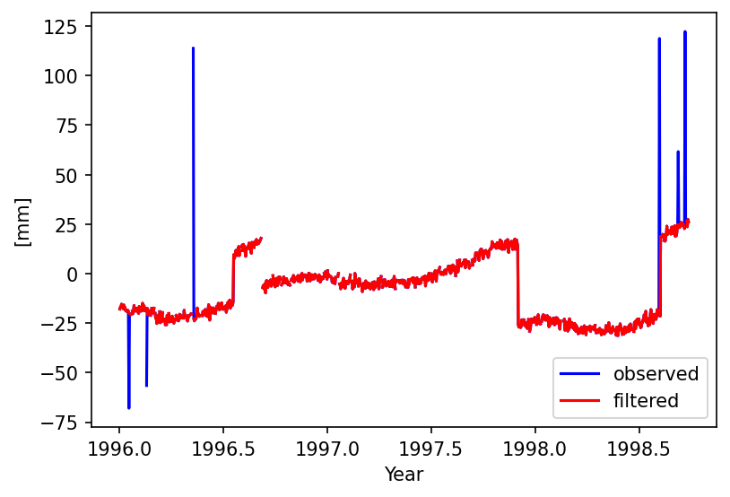
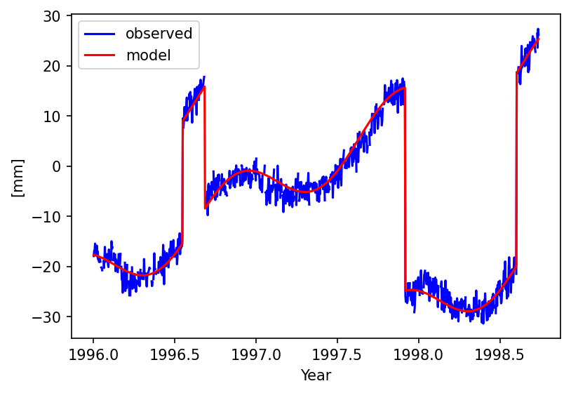
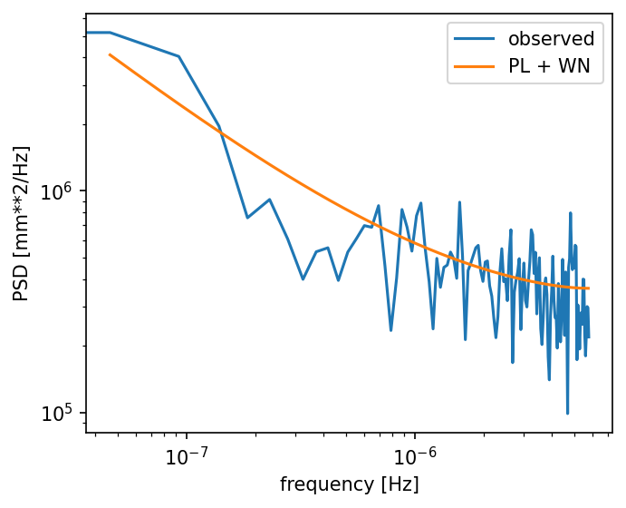

### Example 1: Synthetic GNSS time series with spikes and offsets

Here we discuss an example using a time series in the mom-format. In
[example 2](./example2.md) we will analyse a time series in the msf-format. See 
[file formats](../../doc/fileformats.md) for more details on the format definitions.

HectorP is a set of scripts that can be run from the command line. As explained in [section 2.i of the main README file](../../README.md#installation), it is customary to install HectorP in an virtual environment which should be activated before the scripts become available. Once this is done, one should change directory to `example/ex1` where one should find the following files and directories:
```
README.md
data_figures
estimatespectrum.ctl
estimatetrend.ctl
estimatetrend.json
mom_files
obs_files
pre_files
psd_figures
removeoutliers.ctl
removeoutliers.json
```

In the directory `ex1/obs_files` the file `TEST.mom`
is stored. It represents some fictional observed GNSS coordinate time series. 
The file extension ‘mom’ stands for Modified Julian Date - Observations - 
Model. Here the last component (The fitted model) is missing. The Modified 
Julian Date (MJD) is a convenient format to make plots. You can use the 
programs [date2mjd](../../doc/date2mjd.md) and [mjd2date](../../doc/mjd2date) 
to convert between 
year/month/day/hour/minute/second and MJD values. These data are stored in a 
simple ASCII text file and can be inspected by any normal text editor. When 
doing so, one will detect a few header lines:
```
# sampling period 1.0
# offset 50284.0
# offset 50334.0
# offset 50784.0
# offset 51034.0
```

The first line just tells the program that the sampling period of the data is 
daily (T=1 day). The other lines tell HectorP and which epochs an offset needs 
to be estimated. Since this information is known, the files were stored in the 
`obs_files` directory and not in `raw_files`. For detecting offsets, 
see section 9.3.

For the moment we assume that the information about these epochs of the offsets is given. For example, these are times when the GNSS receiver was changed as specified in the logfile. Later on we will deal with the situation when this information is missing. After the header line, the data are listed (TEST.mom):
```
50084.0 -17.88951
50085.0 -16.88599
50086.0 -16.84916
...
```

## Removal of outliers

To remove the outliers we need to run the program `outliers`.
which requires a control-file called `removeoutliers.ctl` by default. If
another control file is needed, then this needs to be specified on the
command-line:
```
removeoutliers -i other_control_file.ctl
```

HectorP uses various control-files which are simple
text files and the rows with the keywords can occur in any order. If HectorP
cannot find a keyword, then it will complain unless the
keyword is optional. If a keyword is optional and has been omitted, then its
default value will be used. 

The contents of `removeoutliers.ctl` in the `ex1` directory is:
```
DataFile            TEST.mom
DataDirectory       ./obs_files
OutputFile          ./pre_files/TEST.mom
PlotName            TEST_withoutoutliers
seasonalsignal      yes
halfseasonalsignal  no
estimateoffsets     yes
IQ_factor           3.0
PhysicalUnit        mm
ScaleFactor         1.0
```

The explanation of this control file is given [here](../doc/removeoutliers.md).
For now, we can just run it:
```
removeoutliers -graph
```

The output on the screen should be:
```
***************************************
    removeoutliers, version 0.0.6
***************************************

Filename                   : obs_files/TEST.mom
TS_format                  : mom
Number of observations+gaps: 1000
Percentage of gaps         :  10.0
No extra periodic signals are included.
No Polynomial degree set, using offset + linear trend
Found 6 outliers, threshold=21.057649
Found 0 outliers, threshold=19.557014
--> ./pre_files/TEST.mom
---    0.053 s ---
```

This tells the user the time series consist out of 1000 points of which 10% (100 points) are missing. It also informs the user that a linear trend was used. No extra periodic signals (besides annual/semi-annual signals) were included in the analysis. At this stage the user should already have defined the model which he/she wants to fit to the observations. In this case the model is a linear trend + annual signal + offests but more options are described [here](../../doc/trajectory_models.md). The information shown on the screen tells us that during the first iteration 6 outliers were detected. These were removed and in the second interation, no further outliers were detected and the filtered data was written to `./pre_files/TEST.mom`.




Afterwards one can run `estimatetrend`. The associated control file is listed below and a complete list of options is given [here](../../doc/estimatetrend.md).
```
DataFile              TEST.mom
DataDirectory         ./pre_files
OutputFile            ./mom_files/TEST.mom
DegreePolynomial      1
ScaleFactor           1.0
JSON                  yes
NoiseModels           GGM White
GGM_1mphi             6.9e-06
periodicsignals       365.25
estimateoffsets       yes
ScaleFactor           1.0
PhysicalUnit          mm
PlotName              TEST_fittedmodel
useRMLE               yes
```

Most of the keywords are similar to that of `removeoutliers.ctl`. Khe keyword 'seasonalsignal' has been omitted and replaced by the keyword + value 'periodicsignals 365.25' to highlight the fact that keyword 'seasonalsignal yes' is just a shortcut/alias to 'periodicsignals 365.25'. In similar fashion, 'halfseasonalsignal yes is an shortcut/alias to 'periodicsignals 182.625'. 

The important new keyword here is 'NoiseModels'. More details about noise models can be found [here](../../doc/noisemodels.md). To put it briefly, HectorP uses weighted least-squares to fit the trajectory model to the observations. However, the covariance matrix used to 'weigh' the importance of the observations is constructed using the covariance function assosciated to a noise model. HectorP uses maximum likelihood estimation to estimate the optimal values of the parameters of the noise model. HectorP cannot (yet?) select the best combination of noise models but this is a task for the user. For GNSS time series, power-law plus white noise is still a very good choice in almost all situations. Another good choice is Random Walk + Flicker + White noise for GNSS data.  

For this example, we stick to power-law + white noise model. As was explained [here](../../doc/noisemodels.md), power-law noise with a spectral index $`\kappa`$ lower than -1 is non-stationary. Without going into too much detail, the problem with non-stationary noise is that the variance and thus the covariance matrix grows to infinity. Implementing infinity into a computer program is difficult and that is why a trick is used to keep the noise stationary. This trick is to assume the noise becomes stationary for periods longer than 1000 years or so. For the analyses of GNSS time series with a duration of 20-30 years at the most, the results are practically identical to that with true power-law noise. A noise model that behaves like power-law at the higher frequencies but flattens below some treshold is the Generalised Gauss Markov noise model, GGM for short. The threshold value is set with the parameter GGM_1mphi. Thus:
```
NoiseModels           GGM White
GGM_1mphi             6.9e-06
```

Should be interpreted as a smart implementation of:
```
NoiseModels           Powerlaw White
```

The latter actually works for stationary power-law noise (when spectral index $`\kappa`$ is larger than -1). To run `estimatetrend`, type:
```
estimatetrend -graph
```

The output on the screen should be:
```

***************************************
    estimatetrend, version 0.0.6
***************************************

Filename                   : pre_files/TEST.mom
TS_format                  : mom
Number of observations+gaps: 1000
Percentage of gaps         :  10.6
0) GGM
1) White
Nparam : 2
useRMLE-> True
----------------
  AmmarGrag
----------------
Number of iterations : 68
min log(L)           : -1709.922418
ln_det_I             : 16.039672
ln_det_HH            : 52.388205
ln_det_C             : 107.476774
AIC                  : 3441.844835
BIC                  : 3494.597599
KIC                  : 3510.637271
driving noise        : 1.574512

Noise Models
------------
GGM:
fraction  = 0.20528
sigma     =  4.1096 mm/yr^0.30
d         =  0.5935
kappa     = -1.1870
1-phi     =  0.0000 (fixed)

White:
fraction  = 0.79472
sigma     =  1.4036 mm
No noise parameters to show

bias : 1.118 +/- 2.653 (at 50583.50)
trend: 16.715 +/- 1.009 mm/yr
cos  365.250 : 4.072 +/- 0.397 mm
sin  365.250 : -3.950 +/- 0.401 mm
amp  365.250 : 5.687 +/- 0.398 mm
pha  365.250 : -44.051 +/- 4.045 degrees
offset at 50284.0000 :   24.34 +/-  0.82 mm
offset at 50334.0000 :  -24.44 +/-  0.89 mm
offset at 50784.0000 :  -40.49 +/-  0.84 mm
offset at 51034.0000 :   38.42 +/-  0.86 mm
--> ./mom_files/TEST.mom
---   12.613 s ---
```

The bias (nominal offset) and trend value are listed together with their 1-sigma uncertainty. The program also outputs the parameters of the noise model. The spectral index $`kappa`$ is estimated to be -1.1870 and the amplitude of the power-law (i.e., GGM) has an amplitude of 4.1096 mm/yr^0.30. The white noise has an amplitude of 1.4036 mm. The amplitude and phase-lag of the annual signal is also listed as are the values of the estimated offsets. Note that the phase of the periodic signals is counted from 1 January.

Since the keyword 'JSON' was included in the control file (and set to 'yes'), the file `estimatetrend.json` is created which contains the same information shown on screen but in json format which is easier to parse by other computer programs such as `estimatespectrum`.



While the main results have already been obtained, it is always good to check if the chosen noise models acutally fit the noise characteristics of the observations. One way of doing this is by looking at the power-spectral density. One can produce this plot by the following command:
```
estimatespectrum -model -graph 
```

The noise model parameter values are read from `estimatetrend.json`. As usual, this program needs a control file. The default file is `estimatespectrum.ctl`:
```
DataFile            TEST.mom
DataDirectory       ./mom_files
PhysicalUnit        mm
```



Finally, there are situations where one has to process many time series and in these cases it is convenient to automatically detect the time when an offset occurs. This can be done with the script `findoffsets`. However, there is a catch: the outliers should already have been removed or be small enough to have no effect on the searching for offsets. That is why we did not start with this step in this example. In the directory `raw_files` we have copied the output of `removeoutliers` but also removed the information about the time of the offsets and renamed it to `TEST2.mom`. The program can be run as follow:
```
findoffsets -s TEST2 -t 10
```

See the Gitlab Wikipages to find more details about the program `findofsets`. It makes use of the control file `findoffsets.ctl`.

The time series with information about the time of offsets are saved in `obs_files/TEST2.mom`. Finally, the script `estimate_all_trends` can be used to analyse all mom-files in the `obs_files` directory. The simplest way to call it is:
```
estimate_all_trends
```

It will analyse the time series using the Power-law + White noise model and include annual + semi-annual signal besides estimating the offsets. Time series graphs are stored in the directory `data_figures` and power spectral density plots are stored in `psd_figures`. The estimated parameters are all saved in a single file called `hector_estimatetrend.json`.


