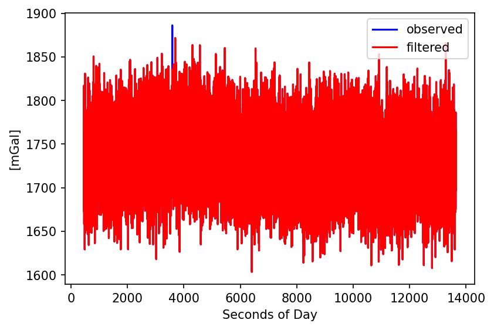
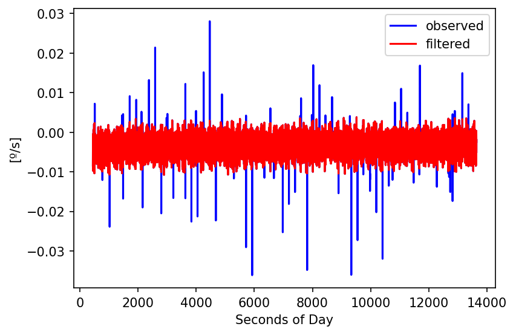
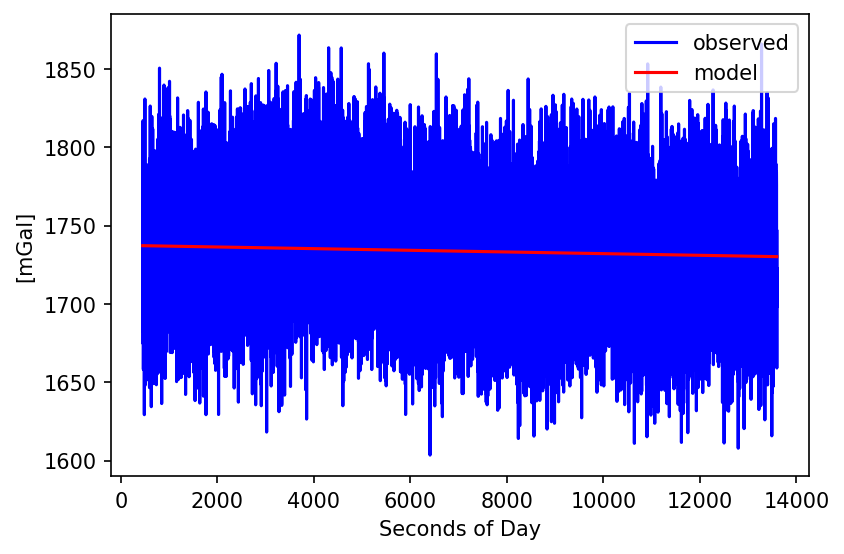
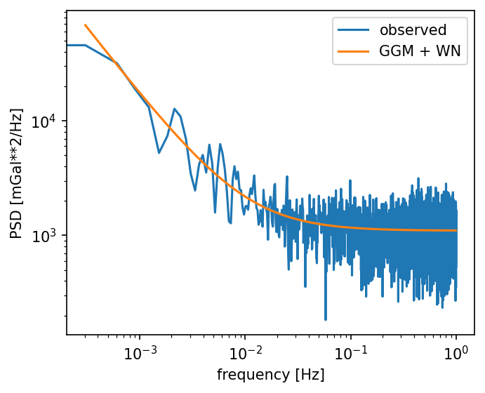
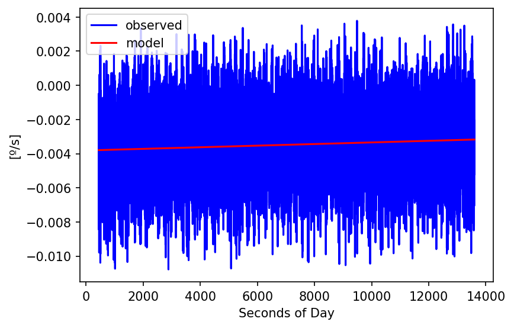
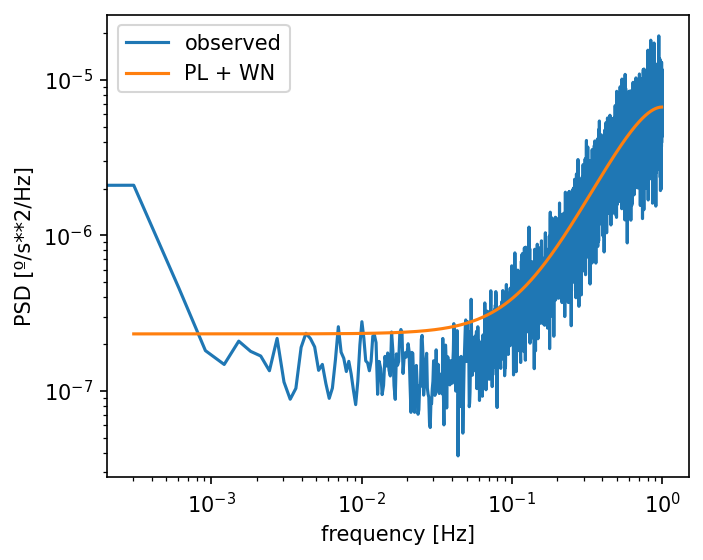

### Example 2: Static IMU time series 

Here we discuss an example using a time series in the msf-format. It follows
the same steps discussed in [example 1](../ex1/README.md). See
"file formats" in the Gitlab-Wiki to learn more about the msf-format.

HectorP is a set of scripts that can be run from the command line. As explained in [section 2.i of the main README file](../../README.md#installation), it is customary to install HectorP in an virtual environment which should be activated before the scripts become available. Once this is done, one should change directory to `example/ex2` where one should find the following files and directories:
```
README.md
data_figures
estimatespectrum.ctl
estimatetrend_acc.ctl
estimatetrend_gyr.ctl
fin_files
obs_files
pre_files
psd_figures
removeoutliers_acc.ctl
removeoutliers_gyr.ctl
```

In the directory `ex2/obs_files` the file `test_data.msf`
is stored. It represents some static IMU coordinate time series, containing
one accelerometer and one gyroscope component. 
The file extension ‘msf’ stands for Modified julian date - Seconds of day - 
Format. The Modified 
Julian Date (MJD) is a convenient format to make plots. You can use the 
programs [date2mjd](../../doc/date2mjd.md) and [mjd2date](../../doc/mjd2date) 
to convert between year/month/day/hour/minute/second and MJD values. 
The seconds of day simply are the numbers of seconds passed after midnight each
day. Thus, there are 86400 seconds per day. 

If you switch to the `obs_files` directory and run:
~~~
msfdump -i test_data.msf -jo w.json -do w.txt
~~~

you can see the contents of test_data.msf:
```
# sampling period 0.500000
#
# mjd: 59749.000000
#
# Observations
# ------------
# 1. sod
# 2. accelerometer
# 3. gyroscope
#
#===============================================================================
  450.500   0.0167330  -0.0084170
  451.000   0.0172990  -0.0026910
  451.500   0.0170810  -0.0028630
  452.000   0.0168720  -0.0052570
...
```


The first line just tells the program that the sampling period of the data is 
half a second (T=0.5 s). The other lines contain the names of the columns. For now we will not 
discuss the problem of offsets.

After the header line, the data are listed (`test_data.msf`):
```
  450.500   0.0167330  -0.0084170
  451.000   0.0172990  -0.0026910
  451.500   0.0170810  -0.0028630
  452.000   0.0168720  -0.0052570
...
```

## Removal of outliers

To remove the outliers we need to run the program `outliers`.
which requires a control-file called `removeoutliers.ctl` by default. If
another control file is needed, then this needs to be specified on the
command-line:
```
removeoutliers -i other_control_file.ctl
```

HectorP uses various control-files which are simple
text files and the rows with the keywords can occur in any order. If HectorP
cannot find a keyword, then it will complain unless the
keyword is optional. If a keyword is optional and has been omitted, then its
default value will be used. 

The contents of `removeoutliers_acc.ctl` in the `ex2` directory is:
```
DataFile              test_data.msf
DataDirectory         obs_files
OutputFile            pre_files/run1.msf
ScaleFactor           1.0e5
PhysicalUnit          mGal
IQ_factor             3
TS_format             msf
ColumnName            accelerator
PlotName              test_data_acc_outliers
```

For a detailed explanation of this control file, see the Gitlab-Wiki pages.

The data of the accelerometer is given in $`m/s^2`$. To convert this into
mGal, the keyword 'ScaleFactor' is set to 1.0e5. Furthermore, the keyword
'TS_format' tells HectorP that not the default 'mom' but the 'msf' format
is used. In addition, the keyword 'ColumnName' tells HectorP that 
we want to read the third column.

We can run `removeoutliers` as follows:
```
removeoutliers -i removeoutliers_acc.ctl -graph
```

The output on the screen should be:
```
***************************************
    removeoutliers, version 0.1.2
***************************************

Filename                   : obs_files/test_data.msf
TS_format                  : msf
ScaleFactor                : 100000.000000
Column Name                : accelerometer
Use Residuals              : False
Number of observations+gaps: 26372
Percentage of gaps         :   0.0
No extra periodic signals are included.
No Polynomial degree set, using offset + linear trend
Found 2 outliers, threshold=140.668376
Found 0 outliers, threshold=140.710888
---   12.409 s ---
```

This tells the user the time series consist out of 26372 points of which 0% are missing. It also informs the user that a linear trend was used. No extra periodic signals were included in the analysis. At this stage the user should already have defined the model which he/she wants to fit to the observations. 
In this case the model is a linear trend but more options are described on the Gitlab Wiki-pages. The information shown on the screen tells us that during the first iteration 1 outlier was detected. This was removed and in the second interation, no further outliers were detected and the filtered data was written to `./pre_files/test_data.msf`.
This file is used in the next step which removes the outliers in the fourth column with the gyroscope observations:
```
removeoutliers -i removeoutliers_gyr.ctl -graph
```

An interested can open the control file `removeoutliers_gyr.ctl` and will note it reads the output of the previous `removeoutliers` run and saves it again to the same file. In this way all columns in a file can be checked for outliers.
~~~
DataFile              test_data.msf
DataDirectory         pre_files
OutputFile            pre_files/test_data.msf
ScaleFactor           1.0
PhysicalUnit          º/s
IQ_factor             3
TS_format             msf
ColumnName            gyroscope
PlotName              test_data_gyr_outliers
~~~






Afterwards one can run `estimatetrend`, again twice. One time to analyse the data in the column with the accelerometer data and afterwards again to analyse the data in the column with the gyroscope data. 
The associated control file `estimatetrend_acc.ctl` is listed below and a complete list of options is given [here](../../doc/estimatetrend.md).
```
DataFile            test_data.msf
DataDirectory       pre_files
OutputFile          fin_files/step1.msf
PhysicalUnit        mGal
ScaleFactor         1.0
NoiseModels         GGM White
GGM_1mphi           1.0e-05
useRMLE             no
TS_format           msf
ColumnName          accelerometer
PlotName            accelerometer
```

Most of the keywords are similar to that of `removeoutliers_acc.ctl`. 
The important new keyword here is 'NoiseModels'. To put it briefly, HectorP uses weighted least-squares to fit the trajectory model to the observations. However, the covariance matrix used to 'weigh' the importance of the observations is constructed using the covariance function assosciated to a noise model. HectorP uses maximum likelihood estimation to estimate the optimal values of the parameters of the noise model. 
HectorP cannot (yet?) select the best combination of noise models but this is a task for the user. 

For this example, we stick to power-law + white noise model. A power-law noise with a spectral index $`\kappa`$ lower than -1 is non-stationary. Without going into too much detail, the problem with non-stationary noise is that the variance and thus the covariance matrix grows to infinity. Implementing infinity into a computer program is difficult and that is why a trick is used to keep the noise stationary. This trick is to assume the noise becomes stationary for periods longer than 100 times the length of the time series that is being analysed. 
A noise model that behaves like power-law at the higher frequencies but flattens below some treshold is the Generalised Gauss Markov noise model, GGM for short. The threshold value is set with the parameter GGM_1mphi. Thus:
```
NoiseModels           GGM White
GGM_1mphi             6.9e-06
```

Should be interpreted as a smart implementation of:
```
NoiseModels           Powerlaw White
```

The latter actually works for stationary power-law noise (when spectral index $`\kappa`$ is larger than -1). To run `estimatetrend`, type:
```
estimatetrend -i estimatetrend_acc.ctl -graph
```

This will take several minutes.
The output on the screen should be:
```
***************************************
    estimatetrend, version 0.0.6
***************************************

Filename                   : pre_files/test_data.msf
TS_format                  : msf
ScaleFactor                : 1.000000
Observation Column         : 3
Use Residuals              : False
Number of observations+gaps: 26372
Percentage of gaps         :   0.0
No extra periodic signals are included.
No Polynomial degree set, using offset + linear trend
0) GGM
1) White
Nparam : 2
useRMLE-> False
----------------
  AmmarGrag
----------------
Number of iterations : 75
min log(L)           : -130311.290029
ln_det_I             : 8.766177
ln_det_HH            : 36.849031
ln_det_C             : 750.175421
AIC                  : 260632.580059
BIC                  : 260673.480160
KIC                  : 260682.246337
driving noise        : 33.391448

Noise Models
------------
GGM:
fraction  = 0.01614
sigma     = 39.0539 mGal/h^0.30
d         =  0.5924
kappa     = -1.1847
1-phi     =  0.0000 (fixed)

White:
fraction  = 0.98386
sigma     = 33.1210 mGal
No noise parameters to show

bias : 1733.284 +/- 10.724 (at 7043.25)
trend: -2.168 +/- 4.192 mGal/h
---  249.813 s ---
```

The bias (nominal offset) and trend value are listed together with their 1-sigma uncertainty. The program also outputs the parameters of the noise model. 
The spectral index $`kappa`$ is estimated to be -1.1847 and the amplitude of the power-law (i.e., GGM) has an amplitude of 39.0539 mGal/h^0.30. 
The white noise has an amplitude of 33.1210 mGal. 



Note that the control file for the gyroscope data (`estimatetrend_gyr.ctl`) again reads the previous file generated by `estimatetrend` and saves it again to `fin_file\test_data.msf`. If we run in the directory `fin_files` the following command:
~~~
msfdump -i test_data.msf -jo w.json -do w.dat
~~~

the file `w.dat` will look like the following:
~~~
# sampling period 0.500000
#
# mjd: 59749.000000
#
# Observations
# ------------
# 1. sod
# 2. accelerometer
# 3. gyroscope
#
# Models
# ------
# 4. mod_accelerometer
# 5. mod_gyroscope
#
#===============================================================================
  450.500 1729.9000000  -0.0084170 1737.1648849  -0.0037921
  451.000 1708.1000000  -0.0026910 1737.1646191  -0.0037921
  ...
  ~~~


Since the keyword 'JSON' was included in the control file (and set to 'yes'), the file `estimatetrend.json` is created which contains the same information shown on screen but in json format which is easier to parse by other computer programs such as `estimatespectrum`.

While the main results have already been obtained, it is always good to check if the chosen noise models acutally fit the noise characteristics of the observations. One way of doing this is by looking at the power-spectral density. One can produce this plot by the following command:
```
estimatespectrum -i estimatespectrum_acc.ctl -model -graph 
```

The noise model parameter values are read from `estimatetrend.json`. As usual, this program needs a control file. The contents of `estimatespectrum_acc.ctl` is:
```
DataFile              test_data.msf
DataDirectory         fin_files
interpolate           no
ScaleFactor           1.0
PhysicalUnit          mGal
Verbose               no
TS_format             msf
ColumnName            accelerometer
UseResiduals          yes
PlotName              accelerometer
```




For the gyroscope data, we need to run again `estimatetrend`:
```
estimatetrend -i estimatetrend_gyr.ctl -graph
```

The output is:
```
***************************************
    estimatetrend, version 0.0.6
***************************************

Filename                   : fin_files/step1.msf
TS_format                  : msf
ScaleFactor                : 1.000000
ColumnName                 : gyroscope
Use Residuals              : False
Number of observations+gaps: 26372
Percentage of gaps         :   0.3
No extra periodic signals are included.
No Polynomial degree set, using offset + linear trend
0) Powerlaw
1) White
Nparam : 2
useRMLE-> False
----------------
  AmmarGrag
----------------
Number of iterations : 98
min log(L)           : 133437.329968
ln_det_I             : 67.863676
ln_det_HH            : 36.849031
ln_det_C             : 5980.489483
AIC                  : -266864.659935
BIC                  : -266823.774645
KIC                  : -266755.910969
driving noise        : 0.001350

Noise Models
------------
Powerlaw:
fraction  = 0.90058
sigma     =  0.0000 º/s/h^-0.50
d         = -0.9990
kappa     =  1.9980

White:
fraction  = 0.09942
sigma     =  0.0004 º/s
No noise parameters to show

bias : -0.003 +/- 0.000 (at 7043.25)
trend: 0.000 +/- 0.000 º/s/h
--> fin_files/test_data.msf
---  502.872 s ---
```

The difference is that now we used a pure power-law model in the control file
instead of GGM. The reason is that now the power-law noise increases with
frequency instead of descreasing. This inverted behaviour results in stationary
noise which means we don't need to use GGM which in addition cannot describe
this type of behaviour.



If we again create a power spectral density plot, this behaviour is clear
to see:
```
estimatespectrum -i estimatespectrum_gyr.ctl -model -graph 
```



