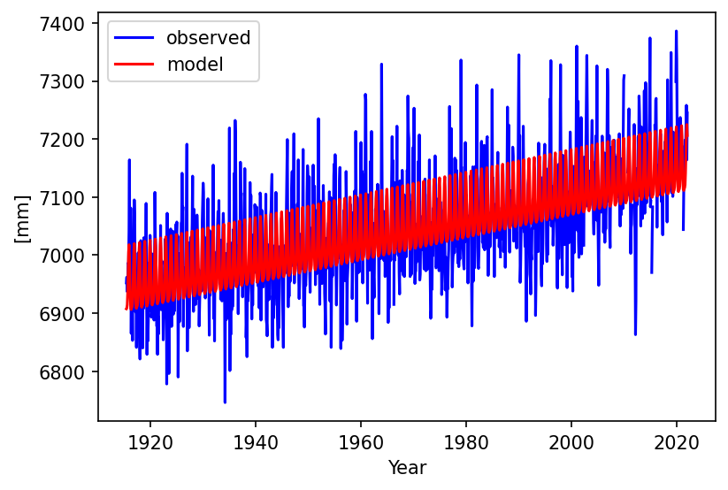
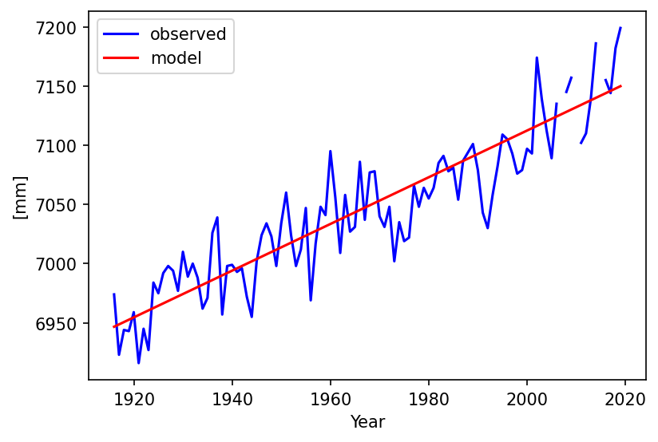
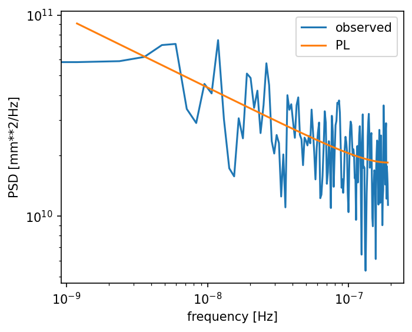
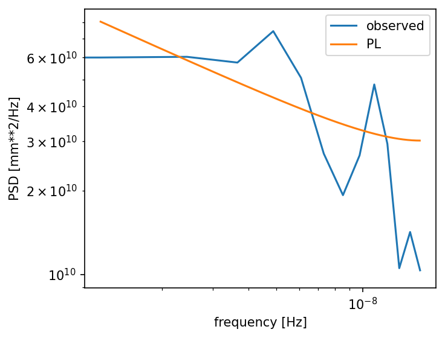

# Analysis of monthly and yearly tide gauge data

Monthly and yearly tide gauge data for the Newlyn station were downloaded from the [PSMSL website](https://www.psmsl.org/data/obtaining/stations/202.php). Using the program 
[convert_rlrdata2mom](../../doc/convert_rlrdata2mom.md) these were converted into the [mom-format](../../doc/dataformats.md):
```
convert_rlrdata2mom -i ori_files/202_yr.rlrdata -o obs_files/202_yr.mom 
convert_rlrdata2mom -i ori_files/202_mn.rlrdata -o obs_files/202_mn.mom 
```

Assuming a standard linear trend and pure power-law noise, the data can
be analysed with the following two commands:
```
estimate_all_trends -n PL -s 202_mn
estimate_all_trends -n PL -noseasonal -s 202_yr
```

For the yearly data it makes no sense to estimate an annual and semi-annual
signal and for this reason the flag `-noseasonal` was added. The resulting
time series, stored in the `data_figures` directory, are plotted below.





Results:
```
trend - monthly : 1.95 ± 0.16 mm/yr
trend - yearly  : 1.97 ± 0.16 mm/yr
```
    
For monthly data (N=1280), the estimated noise model parameters for the power-law
noise model are:
```
sigma     = 82.72360 mm/yr^0.08607
d         =   0.1721 +/- 0.0226
kappa     =  -0.3443 +/- 0.0452
```

For the case of yearly data (N=104), we get:
```
sigma     = 25.6858 mm/yr^0.12
d         =  0.2320
kappa     = -0.4640
```

Ideally, these estimated parameters should be idential. However, the yearly time series is rather short which explains the differences. The trend uncertainties are similar because the lower noise amplitude is compensated by a lower spectral index.

From the section about [noise models](../../doc/noisemodels.md), we know that the power spectral density
for power-law noise is:
```math
 S(f) = 2\frac{\sigma^2}{f_s}\frac{1}{(2\sin(\pi f/f_s))^{2d}}
```

where $`f_s`$ is the sampling frequency in Hertz (Hz) and $`f`$ is the 
frequency, also in Hz.
$`\sigma_{pl}`$ is given by `estimatetrend` but in units of $`mm/yr^{0.12}`$. This was the result of dividing $`\sigma`$ by the factor $`T^{-\kappa/4}`$ where $`T`$ is the fraction of the sampling period (in days) divided by the duration of a year which is 365.25 days. This factor has been based on [Simon Williams (2003)](https://link.springer.com/article/10.1007/s00190-002-0283-4). To get rid of the scaling for the power spectral density plots,
we apply for the monthly data:
```math
\sigma = \sigma_{pl} (1/12)^{-\kappa/4}
```

For the yearly data the scale remains the same:
```math
\sigma = \sigma_{pl} (1/1)^{-\kappa/4} = \sigma
```

The power spectral density plots can be found in the `psd_figures` directory.






The afore mentioned trend uncertainty has been computed inside HectorP using the design matrix $`\vec H`$ and covariance matrix $`\vec C`$:
```math
{\vec C}_\theta = \left({\vec H}^T{\vec C}^{-1}{\vec H}\right)^{-1}
```

where on the diagonal of $`{\vec C}_\theta`$ the variance of the estimated parameters are given. Since we here deal with pure power-law noise, we can use Eq. (29) of [Bos et al. (2008)](https://link.springer.com/article/10.1007/s00190-007-0165-x) to compute the uncertainty of the trend in another way:
```math
\sigma_r^2 \approx \frac{\sigma_{pl}^2}{\Delta T^{2-\alpha/2}}\frac{\Gamma(3−\alpha)\Gamma(4−\alpha)}
                                                                        {(\Gamma(2-\alpha/2))^2} (N-1)^{\alpha-3}
```

In 2008 the usage of $`\kappa`$ (=$`-\alpha`$) for the spectral index was not yet wide spread but already advocated by Simon Williams. Also $`\Delta T`$ has been replaced $`T`$ in all the rest of the documentation. Thus, we have:
```math
\sigma_r^2 \approx \frac{\sigma_{pl}^2}{T^{\kappa/2}}\frac{1}{T^2}\frac{\Gamma(3+\kappa)\Gamma(4+\kappa)}
                                                                        {(\Gamma(2+\kappa/2))^2} (N-1)^{-\kappa-3}
```

Here $`\sigma_{pl}`$ is the noise amplitude WITH the $`T^{-\kappa/4}`$ factor. Here the factor $`T^{\kappa/2}`$ is separate from $`T^2`$ to emphasize that this term is needed to remove the scaling of the noise amplitude. The other term $`T`$ is just needed to convert from the sampling period (e.g., daily/weekly) to yearly periods since the uncertainty is given as mm/yr, not mm/day or mm/week. For monthly data $`T=1/12`$, for yearly data $`T=1`$. Using $`\sigma_{pl}`$=82.72360, $`\kappa`$=-0.3443 and $`N`$=1280, we get:
```
NEWLYN (monthly), sigma_r =  0.156 (estimatetrend)  0.162 (Eq. 29) mm/yr
NEWLYN (yearly ), sigma_r =  0.169 (estimatetrend)  0.176 (Eq. 29) mm/yr
```

Finally, to make sure all is correct, 3000 monthly values of power-law with $`\kappa=-1`$ and $`\sigma_{pl}=10 `$ $`mm/yr^{0.25}`$ were generated. This exercise was repeated to create 21000 daily values with the same noise properties. `estimatetrend` was used to estimate the trend. If was able to correctly retrieve these noise parameters. The trend uncertainty given by `estimatetrend` and using Eqs. (29) and (32) of [Bos et al. (2008)](https://link.springer.com/article/10.1007/s00190-007-0165-x) are:
```
synthetic (daily) , sigma_r = 0.065 (estimatetrend) 0.063 (Eq. 29) 0.063 (Eq. 32)  mm/yr
synthetic (weekly), sigma_r = 0.099 (estimatetrend) 0.103 (Eq. 29) 0.103 (Eq. 32)  mm/yr
```


