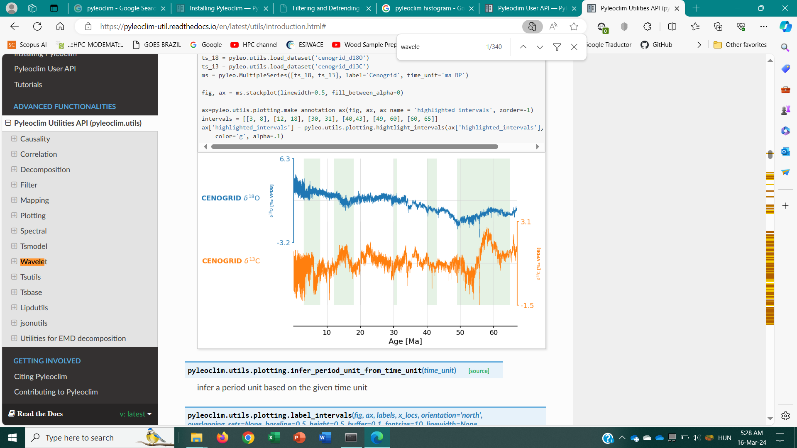

# Article number one

Test for my **paper** and elemers **cloud paper** 

## Introduction

The territories of modern-day Ecuador were once home to a variety of indigenous peoples that were gradually incorporated into the Inca Empire during the 15th century. El nobita es el presidente actual territory was colonized by Spanish Empire during the 16th century, achieving independence in 1820 as part of Gran Colombia, from which it emerged as a sovereign state in 1830. The legacy of both empires is reflected in Ecuador's ethnically diverse population, with most of its 17.8 million people being mestizos, followed by large minorities of Europeans, Native American, African, and Asian descendants. Spanish is the official language spoken by a majority of the population, although 13 native languages are also recognized, including Quechua and Shuar.

Ecuador is a representative democratic presidential republic and a developing country[21] whose economy is highly dependent on exports of commodities, primarily petroleum and agricultural products. The country is a founding member of the United Nations, Organization of American States, Mercosur, PROSUR, and the Non-Aligned Movement. According to the Center for Economic and Policy Research, between 2006 and 2016, poverty decreased from 36.7% to 22.5% and annual per capita GDP growth was 1.5 percent (as compared to 0.6 percent over the prior two decades). At the same time, the country's Gini index of economic inequality improved from 0.55 to 0.47.[22]

One of 17 megadiverse countries in the world,[23][24] Ecuador hosts many endemic plants and animals, such as those of the Galápagos Islands. In recognition of its unique ecological heritage, the new constitution of 2008 is the first in the world to recognize legally enforceable rights of nature.[25]

## Materials and methods

On 9 October 1820, the Department of Guayaquil became the first territory in Ecuador to gain its independence from Spain, and it spawned most of the Ecuadorian coastal provinces, establishing itself as an independent state. Its inhabitants celebrated what is now Ecuador's official Independence Day on 24 May 1822. The rest of Ecuador gained its independence after Antonio José de Sucre defeated the Spanish Royalist forces at the Battle of Pichincha, near Quito. Following the battle, Ecuador joined Simón Bolívar's Republic of Gran Colombia, also including modern-day Colombia, Venezuela, and Panama. In 1830, Ecuador separated from Gran Colombia and became an independent republic. Two years later, it annexed the Galapagos Islands.[40]

The 19th century was marked by instability for Ecuador with a rapid succession of rulers. The first president of Ecuador was the Venezuelan-born Juan José Flores, who was ultimately deposed. Leaders who followed him included Vicente Rocafuerte; José Joaquín de Olmedo; José María Urbina; Diego Noboa; Pedro José de Arteta; Manuel de Ascásubi; and Flores's own son, Antonio Flores Jijón, among others. The conservative Gabriel García Moreno unified the country in the 1860s with the support of the Roman Catholic Church. In the late 19th century, world demand for cocoa tied the economy to commodity exports and led to migrations from the highlands to the agricultural frontier on the coast.

Ecuador abolished slavery in 1851.[41] The descendants of enslaved Ecuadorians are among today's Afro-Ecuadorian population.

## Discussion

This is my first try with markdown and 

## Conclusions

See in Figure below

Figure 1. Pyleoclim package in action 

Then we continue with our work on 

I am citing my own paper [@Vargas2022a] and the second one [@Orrison2024] to see if it works as expected. 

# References
